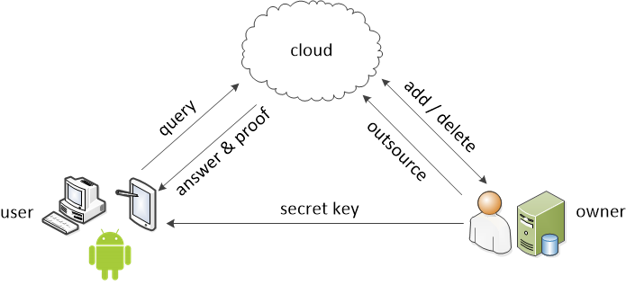

# Dynamic Verifiable Data Access
Consider the following cloud storage security problem: A user outsources his/her data to a cloud and later frequently updates the data by adding new data items and deleting existing ones. When the user requests a data item from the cloud, what if the cloud claims that the data item does not exist while in fact it does exist? This could happen due to cloud management issues, hardware/software failures, hackers, or economic incentives like saving cloud's operation costs. The ability to confirm the data existence/non-existence when accessing a data item on the cloud is referred to as *verifiable data access*.

The code here implements and evluates a dynamic verifiable data access protocol that supports dynamic data search and that is also efficient for practical usage.

## Build

We use Java 1.8 to develop this project and use Eclipse to compile it. There are two ways to run the program. If you are using Eclipse for Java development, you can do it as follows:
1.  Import the source code project into Eclipse. Try the menu “File -> Import -> Existing Projects into Workspace”.
2.  Locate the file “PerformanceEvaluate.java” which is the entrance of the whole program.
3.  Replace the string "D:\\test\\files\\test6" with your destination directory which stores the files that the data owner wants to outsource.
4.  The performance result will be output in the console window.

If you are used to compile a java program in the command line, you can do it as follows:
1.  Unzip the source code. Find all source codes in the directory “../src/fchen/”, compile all the source code.
2.  Locate the file “PerformanceEvaluate.java” which is the entrance of the whole program.
3.  Replace the string "D:\\test\\files\\test6" with your destination directory which stores the files that the data owner wants to outsource. Compile the program and then run it.
4.  The performance result will be output in the console window.

Note that we employ a third-party utility class MemoryUtil to measure the size of an running object in the memory.  To use this class, we need to send a parameter to the Java Virtual Machine: `-javaagent:classmexer.jar`. For more information about MemoryUtil, please refer to http://www.javamex.com/classmexer/.

## Code organization

There are 7 classes in the source code. For details, please refer to the help file, which is generated by the “javadoc” program. In the following, a brief introduction is presented.
1.  HashTree.java - This class implements the hash authentication tree primitive, including computing the root value of a hash tree, getting an authentication path for a leaf, and modifying the leaf nodes.
2.  DynamicVFS.java – This is the key code to implement our protocol.
3.  MetaProofData - This class encapsulates the tuple (index, filename, state, authentication path) and some corresponding methods.
4.  ProofData.java –This class encapsulates the search result returned by the cloud, together with its correctness proof.
5.  CorrectnessCheck.java – This class checks whether the program is correct. There is a “main” function in this class; thus, it can also be run.
6.  Benchmark.java – This class measures the performance of the basic protocol in terms of memory and computation cost. It runs a lot of problem instances and then gets the performance data by averaging.
7.  PerformanceEvaluate.java – This is the main entrance for evaluating the performance of the semantic hash tree based protocol. To evaluate another destination directory that contains the files to be outsourced, just modify this class, i.e. replacing the destination directory with another one. 

## Contributing

Please feel free to fork this code.
